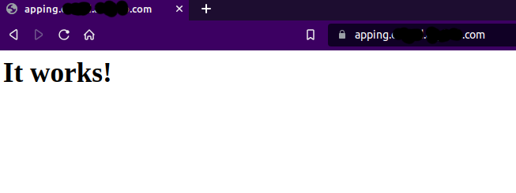

# GKE-ingress-https-letsencrypt
Setup TLS certificates using cert-manager in ingress GKE

- We will use httpd image to deploy and test https

**1. create namespace, deployment and service**

```
kubectl create -f namespace.yml
kubectl create -f httpd-deployment.yml
kubectl create -f  httpd-service.yml
```

**2. Add the official nginx stable Helm repo:**
```
 helm repo add ingress-nginx https://kubernetes.github.io/ingress-nginx
 helm repo update
```

**3. Install the ingress-nginx chart:**
```
helm install my-ingress ingress-nginx/ingress-nginx
```

**4. Install cert-manager for Let's Encrypt SSL certificates.**

Add the Jetstack Helm repository:

```
 helm repo add jetstack https://charts.jetstack.io
 helm repo update
```

- Create ingress resource

```
kubectl create -f Ingress.yml
```


**Map ingress IP with Domain name once ingress installation finished**

- get IP address and map domain name to external IP

```
kubectl get svc
NAME                                            TYPE           CLUSTER-IP   EXTERNAL-IP      PORT(S)                      AGE
kubernetes                                      ClusterIP      10.0.0.1     <none>           443/TCP                      21d
my-ingress-ingress-nginx-controller             LoadBalancer   10.0.10.45   x.x.154.x        80:31577/TCP,443:30491/TCP   71m
my-ingress-ingress-nginx-controller-admission   ClusterIP      10.0.8.16    <none>           443/TCP                      71m


```

**Set up cert-manager**

- Install the cert-manager Helm chart

```
helm install cert-manager jetstack/cert-manager --namespace cert-manager --create-namespace --version v1.12.3 --set installCRDs=true
```

**Set up the ClusterIssuer resource for Let's Encrypt**


```
kubectl create -f cluster-issuer.yml
```


- Check deployed ingress resource and deployment

```
kubectl get ing,svc,po -n dev
NAME                                   CLASS   HOSTS                     ADDRESS          PORTS     AGE
ingress.networking.k8s.io/my-ingress   nginx   xxx.xxx.xxx.com           xx.x.154.xxx     80, 443   35m

NAME                     TYPE        CLUSTER-IP    EXTERNAL-IP   PORT(S)   AGE
service/my-app-service   ClusterIP   10.0.15.253   <none>        80/TCP    44m

NAME                          READY   STATUS    RESTARTS   AGE
pod/my-app-849dd7f565-dlpbp   1/1     Running   0          44m
```


- Check ingress controller

```
kubectl get all
NAME                                                       READY   STATUS    RESTARTS   AGE
pod/my-ingress-ingress-nginx-controller-759f967b9f-ng8pf   1/1     Running   0          56m

NAME                                                    TYPE           CLUSTER-IP   EXTERNAL-IP      PORT(S)                      AGE
service/kubernetes                                      ClusterIP      10.0.0.1     <none>           443/TCP                      21d
service/my-ingress-ingress-nginx-controller             LoadBalancer   10.0.10.45   x.x.154.x        80:31577/TCP,443:30491/TCP   56m
service/my-ingress-ingress-nginx-controller-admission   ClusterIP      10.0.8.16    <none>           443/TCP                      56m

NAME                                                  READY   UP-TO-DATE   AVAILABLE   AGE
deployment.apps/my-ingress-ingress-nginx-controller   1/1     1            1           56m


NAME                                                             DESIRED   CURRENT   READY   AGE
replicaset.apps/my-ingress-ingress-nginx-controller-759f967b9f   1         1         1       56m

```

- Check cert-manager resources

```
kubectl get all -n cert-manager
NAME                                           READY   STATUS    RESTARTS   AGE
pod/cert-manager-65dfbdf7d6-hp5hb              1/1     Running   0          42m
pod/cert-manager-cainjector-79f5dbffcf-vh4rx   1/1     Running   0          42m
pod/cert-manager-webhook-77b984cc67-86rb7      1/1     Running   0          42m

NAME                           TYPE        CLUSTER-IP    EXTERNAL-IP   PORT(S)    AGE
service/cert-manager           ClusterIP   10.0.11.146   <none>        9402/TCP   42m
service/cert-manager-webhook   ClusterIP   10.0.11.100   <none>        443/TCP    42m

NAME                                      READY   UP-TO-DATE   AVAILABLE   AGE
deployment.apps/cert-manager              1/1     1            1           42m
deployment.apps/cert-manager-cainjector   1/1     1            1           42m
deployment.apps/cert-manager-webhook      1/1     1            1           42m

NAME                                                 DESIRED   CURRENT   READY   AGE
replicaset.apps/cert-manager-65dfbdf7d6              1         1         1       42m
replicaset.apps/cert-manager-cainjector-79f5dbffcf   1         1         1       42m
replicaset.apps/cert-manager-webhook-77b984cc67      1         1         1       42m
```

##Browse and check

https://xxxx.xxxx.xxxx.com  

you will get similar to below

